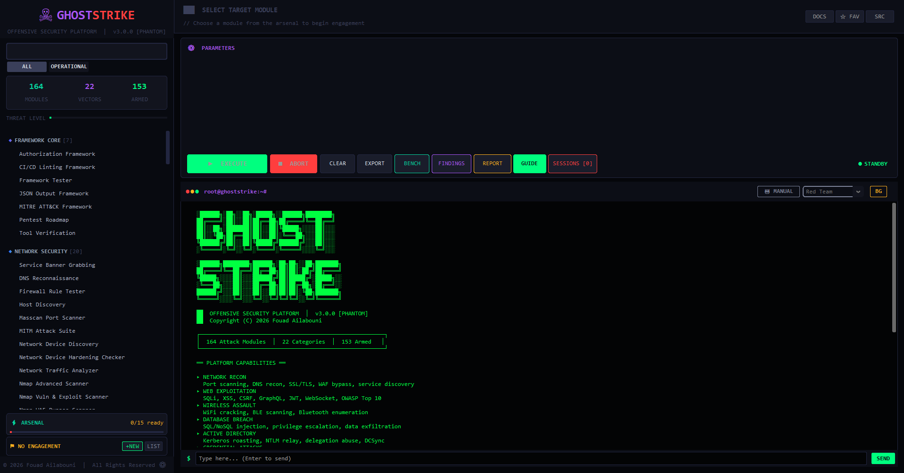

# GhostStrike — Root Project Overview

> © 2026 Fouad Ailabouni. All Rights Reserved.

---

## Overview

**GhostStrike v3.0.0 [PHANTOM]** is a production-grade offensive security assessment platform built for professional penetration testers and red team operators. It combines a CustomTkinter-based GUI launcher with a modular bash scripting framework to deliver structured, evidence-backed, reproducible security assessments.

GhostStrike runs 164 discrete modules across 22 attack categories, enforces a policy engine before any module fires, records tamper-evident evidence chains, scores reproducibility on a 0–100 scale, and validates effectiveness through an integrated benchmark mode against known-vulnerable targets. An optional **AI Co-Pilot mode** lets a specialized LLM agent (Red Team, Blue Team, CTF Solver, and other personas) drive the same modules on your behalf — every action it takes still passes through the identical policy/trust/scope gate a manual run does.

---

## Architecture

```
GhostStrike/
├── CyberToolkit/                   # GUI launcher (Python / CustomTkinter)
│   ├── ghoststrike.py              # Main GUI entry point
│   ├── cyber_toolkit.py            # Alternate launcher
│   └── assets/                     # Icons, images, branding
│
├── CyberToolkit/ai_engine/          # AI Co-Pilot: agent personas, guardrails,
│   ├── agents/                      # pluggable model backend, redaction
│   └── ...
│
└── bash_scripts_for_pentest/       # Core scripting framework
    ├── lib/                        # Shared library modules
    │   ├── common.sh                   (auto-sources policy_engine.sh,
    │   │                                 evidence.sh, finding_ontology.sh,
    │   │                                 reproducibility.sh for every module)
    │   ├── policy_engine.sh            (reads policy.yaml at runtime)
    │   ├── policy_query.py
    │   ├── scope_check.py              (real CIDR/domain scope enforcement)
    │   ├── evidence.sh
    │   ├── finding_ontology.sh
    │   ├── reproducibility.sh
    │   ├── trust_registry.sh
    │   ├── vault.sh                    (AES-256-GCM credential vault)
    │   ├── session_manager.sh          (persistent Metasploit RPC sessions)
    │   └── msf_rpc_client.py
    ├── schemas/                    # JSON schema definitions
    │   └── finding.schema.json
    ├── metrics/                    # Reproducibility reporting
    │   └── reproducibility_report.sh
    ├── benchmarks/                 # Benchmark validation mode
    │   ├── run_benchmarks.sh
    │   └── scenarios/
    ├── policy.yaml                 # Policy engine configuration
    ├── scope.yml.template          # Engagement scope template
    ├── repro_runner.sh             # Reproducibility wrapper
    ├── 00-Framework-Core/
    ├── 01-Network-Security/
    ├── 02-Web-Application-Security/
    ├── 03-Wireless-Security/
    ├── 04-Database-Security/
    ├── 05-Active-Directory/
    ├── 06-Password-Attacks/
    ├── 07-Social-Engineering/
    ├── 08-System-Security/
    ├── 09-Container-Security/
    ├── 10-Mobile-Security/
    ├── 11-Cloud-Security/
    ├── 12-Exploitation/
    ├── 13-Post-Exploitation/
    ├── 14-Reporting-Tools/
    ├── 15-Automation-Tools/
    ├── 16-Specialized-Testing/
    ├── 17-Monitoring-Detection/
    ├── 18-Application-Security/
    ├── 19-Lab-Environment/
    ├── 20-IoT-Security/
    └── 21-Bypass-Techniques/
```

---

## Quick Start

### Launch the GUI

```bash
python3 CyberToolkit/ghoststrike.py
```

Or via the alternate launcher:

```bash
python3 CyberToolkit/cyber_toolkit.py
```

### Run Scripts Directly

```bash
# Network scan with policy enforcement and evidence capture
cd bash_scripts_for_pentest
./repro_runner.sh 01-Network-Security/nmap_automation.sh 192.168.1.0/24

# Web application assessment
./repro_runner.sh 02-Web-Application-Security/owasp_top10_scanner.sh https://target.example.com

# Run full benchmark suite
./benchmarks/run_benchmarks.sh --target all --report
```

### View Reproducibility Reports

```bash
cd bash_scripts_for_pentest
./metrics/reproducibility_report.sh
```

---

## Framework Features

### Policy Engine
All modules pass through `lib/policy_engine.sh` before execution. The engine validates authorization tokens, enforces scope boundaries defined in `scope.yml` (real CIDR/domain-aware matching via `lib/scope_check.py`, not substring matching), checks module trust levels, and takes pre-execution snapshots. Modules that fail policy checks are blocked with exit code 77 — they do not run, and the block is logged. Trust-level and per-module approval rules are read from `policy.yaml` at runtime (via `lib/policy_query.py`), not hardcoded, so changing policy doesn't require touching code.

### AI Co-Pilot
An optional Manual/AI toggle in the GUI lets a specialized agent persona (Red Team, Blue Team, Web Pentest, CTF Solver, DFIR, and others) reason about a plain-language task and drive modules on your behalf. Every module call it makes still goes through the exact same `gs_policy_gate` check a manual run does — a module without confirmed policy-gate wiring is refused, not attempted. API keys are resolved from `lib/vault.sh` or an `ANTHROPIC_API_KEY`/`OPENAI_API_KEY` environment variable; outbound data to the LLM provider is redacted before it leaves the machine.

### Evidence Provenance
`lib/evidence.sh` initializes a per-session evidence directory, hashes all collected artifacts with SHA-256, attaches MITRE ATT&CK technique tags to each artifact, signs the final manifest, and writes a tamper-evident chain log. Export targets: structured JSON and SARIF 2.1.0.

### Reproducibility Scoring
`lib/reproducibility.sh` tracks tool versions, logged commands, scope documentation, and artifact hashing across each session. Sessions receive a 0–100 score and a badge (EXCELLENT / GOOD / FAIR / POOR). `repro_runner.sh` wraps any module with full reproducibility instrumentation.

### Finding Ontology
`lib/finding_ontology.sh` normalizes all findings against a strict schema (`schemas/finding.schema.json`), enforces required fields, maps CVSS v3 scores, associates MITRE ATT&CK techniques, and exports to SARIF 2.1.0 or structured JSON for downstream toolchain integration.

### Module Trust Levels
`lib/trust_registry.sh` maintains trust classifications (`SAFE_ENUM` / `VALIDATION` / `HIGH_IMPACT` / `LAB_ONLY`) for all 164 modules. Trust levels gate execution permissions and are surfaced in the GUI as threat level indicators. Unregistered or untrusted modules are blocked at policy check time. `bash_scripts_for_pentest/MODULE_INVENTORY.csv` is the authoritative, regenerable (`tests/generate_module_inventory.sh`) machine-readable record of every module's trust level and wiring status, and is what the GUI reads at runtime — no hardcoded module list to drift out of sync.

### Benchmark Mode
`benchmarks/run_benchmarks.sh` runs modules for real against known-vulnerable targets (DVWA, Juice Shop, and a custom Metasploitable-style lab container) and scores PASS/FAIL against expected-finding strings defined in `benchmarks/scenarios/*.yaml` — the YAML files are the actual source of truth, not a parallel hardcoded list. Results are written to timestamped JSON reports in `benchmarks/results/`.

### Session Management
`lib/session_manager.sh` gives modules real, persistent session tracking across separate invocations via a long-lived `msfrpcd` daemon (`lib/msf_rpc_client.py`), so a session established by one module (e.g. `metasploit_automation.sh`) can be interacted with by a later one instead of each invocation being a disposable, disconnected process.

---

## Module Count

| Category | Scripts |
|---|---|
| 00-Framework-Core | 7 |
| 01-Network-Security | 20 |
| 02-Web-Application-Security | 22 |
| 03-Wireless-Security | 4 |
| 04-Database-Security | 4 |
| 05-Active-Directory | 16 |
| 06-Password-Attacks | 4 |
| 07-Social-Engineering | 3 |
| 08-System-Security | 11 |
| 09-Container-Security | 1 |
| 10-Mobile-Security | 2 |
| 11-Cloud-Security | 10 |
| 12-Exploitation | 2 |
| 13-Post-Exploitation | 8 |
| 14-Reporting-Tools | 1 |
| 15-Automation-Tools | 2 |
| 16-Specialized-Testing | 3 |
| 17-Monitoring-Detection | 5 |
| 18-Application-Security | 2 |
| 19-Lab-Environment | 1 |
| 20-IoT-Security | 16 |
| 21-Bypass-Techniques | 20 |
| **Total** | **164** |

45 of these were ported from a sibling project (PhantomOps) and individually re-wired for `gs_policy_gate`; see `SCRIPT_INVENTORY.md` for the full per-module trust-level and quality breakdown.

---

## Requirements

| Component | Requirement |
|---|---|
| Python | 3.8 or higher |
| customtkinter | Latest stable |
| Pillow (PIL) | Latest stable |
| Bash | 4.0 or higher |
| nmap | Any recent version |
| sqlmap | Any recent version |
| nikto | Any recent version |
| metasploit-framework | Any recent version |
| jq | Any recent version (for JSON parsing) |
| python3-jsonschema | For schema validation |
| pyyaml | For `policy.yaml`-driven policy enforcement |
| anthropic / openai (optional) | Only needed for AI Co-Pilot mode |

Install core dependencies on Debian/Ubuntu:

```bash
sudo apt-get update
sudo apt-get install -y nmap masscan nikto dirb sqlmap metasploit-framework jq python3-pip
pip3 install customtkinter pillow jsonschema pyyaml
pip3 install anthropic openai   # optional, for AI Co-Pilot mode
```

---

## License

GhostStrike is released under the **GhostStrike Public Source License v1.0**
(inspired by the Nmap Public Source License) — see [LICENSE](LICENSE) for the
full text. In short:

- Free public use, and the full source stays public.
- Modified versions/forks must remain under this same license and make their
  source available.
- Embedding, bundling, or redistributing GhostStrike inside a proprietary
  commercial product, or offering it as a paid/hosted service, requires a
  separate OEM/commercial license from the copyright owner.
- The "GhostStrike" name and branding may not be used for derivative or
  unrelated products without permission.

For a commercial/OEM license, contact: **fouadailabounifouad@gmail.com**

---

## Legal Disclaimer

GhostStrike is provided exclusively for use in authorized security testing and lawful penetration testing engagements. You must obtain explicit written authorization from the owner of any system, network, or application before using these tools against it.

Unauthorized use of these tools against systems you do not own or do not have written permission to test may violate computer fraud and abuse laws in your jurisdiction. The authors and contributors of GhostStrike accept no liability for any damage, loss, or legal consequences resulting from unauthorized or unlawful use.

**If you do not have explicit written authorization to test a target, do not use GhostStrike against it.**

---

> © 2026 Fouad Ailabouni. All Rights Reserved.
> GhostStrike v3.0.0 [PHANTOM] — For authorized security testing only.
